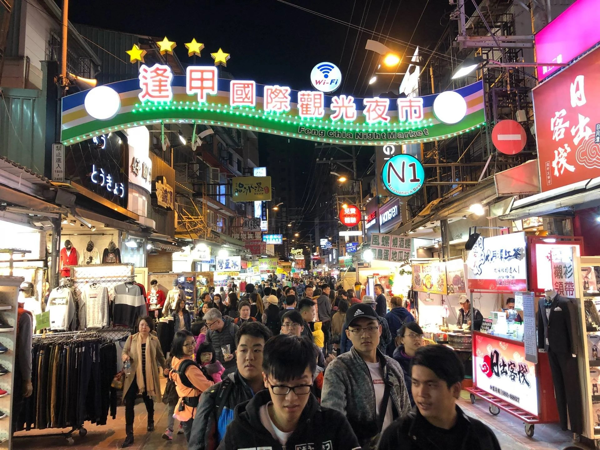

**Date**: December 3 (Thu), 2026

This year’s four-hour excursion will take us to Feng Chia Night Market in Taichung, one of Taiwan’s most vibrant and popular night markets. As evening falls, we’ll stroll through the lively streets filled with colorful signs, bustling crowds, and the irresistible aromas of local street food. Along the way, participants can sample a wide variety of Taiwanese favorites, such as fried chicken cutlets, grilled skewers, sausages, stinky tofu, bubble tea, and creative snacks unique to the area. In addition to enjoying the food, there will also be time to browse the many clothing stores, souvenir shops, game stalls, and small local boutiques throughout the market. This relaxed four-hour visit offers a wonderful opportunity to experience Taiwan’s energetic night-market culture, enjoy delicious food, and spend an enjoyable evening together.

今年的行程將安排一趟約四小時的臺中逢甲夜市之旅。隨著夜幕降臨，我們將漫步於熱鬧繁華的夜市街道，在繽紛招牌、熙來攘往的人群與陣陣美食香氣中，感受最具臺灣特色的夜市文化。沿途可自由品嚐各式在地小吃，例如香酥雞排、炭烤串燒、臺式香腸、臭豆腐、珍珠奶茶，以及充滿創意的特色點心。除了享用美食之外，也可逛逛夜市中的服飾店、伴手禮商店、遊戲攤位與特色小店，體驗逢甲商圈多元而充滿活力的氛圍。透過這趟輕鬆愉快的四小時行程，大家不僅能品嚐臺灣美食，也能深入感受熱鬧且富有人情味的夜市生活，為旅程留下難忘的夜晚回憶。

