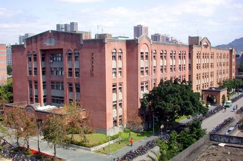

Anoucement that Taiwan THz Winter workshop (II) 2025 will be held in National Taiwan University, Taipei.

<!--more-->

The Taiwan THz summer workshop 2025 will be hosted by the Department of Electrophysics at National Yang Ming Chiao Tung University, with further details found [here](). The dates are Thu-26/Jun and 27/Jun with an excursion on Sat-28/Jun.

<!--  -->
