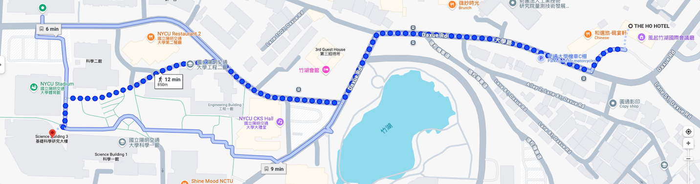



<div2>

# Venue location

Department of Electrophysics, NYCU  
Science Building III, No 1001, University Rd.,  
 Hsinchu 300, Taiwan   

國立陽明交通大學 科學三館 (B1 次軒廳 )

Google maps link: https://maps.app.goo.gl/bjYWRc1ZWxxqwe257

<iframe class="map" src="https://www.google.com/maps/embed?pb=!1m18!1m12!1m3!1d1076.8897928418323!2d120.99553390008968!3d24.788230310415784!2m3!1f0!2f0!3f0!3m2!1i1024!2i768!4f13.1!3m3!1m2!1s0x3468360f064733d5%3A0xd33f1dde69784a93!2z5ZyL56uL6Zm95piO5Lqk6YCa5aSn5a2456eR5a245LiJ6aSo!5e0!3m2!1sen!2stw!4v1741933490746!5m2!1sen!2stw" width="100%" height="500px" style="border:0;" loading="lazy" referrerpolicy="no-referrer-when-downgrade"></iframe>

# Accommodation 

THE HO HOTEL (Hotel/HSR Free Shuttle Service)
THE HO HOTEL is the official accommodation for the 2025 Taiwan THz Summer Workshop, offering special reduced rates and essential assistance with your reservation. To book a room, please contact the conference secretary, Shelly Lee, at [taiwanthz@gmail.com](mailto:taiwanthz@gmail.com), before May 30.

**Address**: 

No.16, Daxue Rd., East Dist., Hsinchu City 300, Taiwan   
Tel: +886-3-571-5888, Email: [fo@thehohotel.com.tw](mailto:fo@thehohotel.com.tw)

和選旅   
地址300新竹市大學路16號   
電話03-5715888, 信箱: [fo@thehohotel.com.tw](mailto:fo@thehohotel.com.tw)


[https://maps.app.goo.gl/owuETkkwNpegJh458](https://maps.app.goo.gl/owuETkkwNpegJh458)

<iframe class="map" src="https://www.google.com/maps/embed?pb=!1m14!1m8!1m3!1d3622.1742660481636!2d121.003074!3d24.7894856!3m2!1i1024!2i768!4f13.1!3m3!1m2!1s0x34683611702a8d29%3A0x14d723a17b87912f!2sTHE%20HO%20HOTEL!5e0!3m2!1sen!2stw!4v1742782804983!5m2!1sen!2stw" width="100%" height="450" style="border:0;" allowfullscreen="" loading="lazy" referrerpolicy="no-referrer-when-downgrade"></iframe> 



*Transportation Guide*  
Travel between the Hotel and Conference Venue (12 minutes walk)

# Taoyuan Airport to THE HO HOTEL

## Method 1: Taxi (direct)
to the THE HO HOTEL (和選旅)
Duration: 40–60 minutes (depending on traffic).
Cost: NT$1,200–1,500.

## Method 2: Bus + Walk (9 mins)
1. Take the Bus (#1250, RI HAO BUS) from the Taoyuan International Airport Terminal 1/Terminal 2 Stop to National Yang Ming Chiao Tung Stop. Duration: 50 - 70 minutes. Cost: NT$200. 
2. National Yang Ming Chiao Tung Stop, walk toward Daxue Rd for 3-4 mins and take the right turn.  Walk for 4-6 mins to the THE HO HOTEL (和選旅). 
Total Duration:  60 – 80 minites 
Total Cost:  NT$200.

## Method 3: Airport MRT + High-speed rail (HSR) + Free Shuttle 
1. Take the Taoyuan Airport MRT (Blue Line) from the airport to Taoyuan HSR Station (A18). Duration: 17-20 minutes. Cost: NT$25. 
2. At Taoyuan HSR Station, take a high-speed rail (HSR) from Taoyuan Station to Hsinchu Station. Duration: 10 minutes. Cost: NT$130.
3. Take free shuttle* from Hsinchu HSR station directly to the THE HO HOTEL (和選旅).  Duration: 10 minutes. *Reserve in advance.
Total Duration:  60 - 70 minites 
Total Cost:  NT$155.

</div2>
