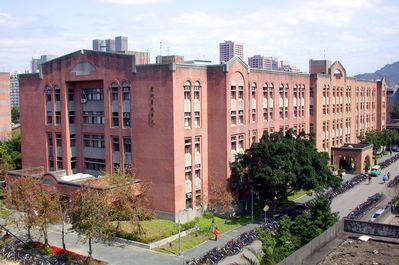



<div2>

# Venue location

Department of Electrophysics, NYCU  
Science Building III, No 1001, University Rd.,  
 Hsinchu 300, Taiwan   

國立台大電機二館142室

Google maps link: https://maps.app.goo.gl/8v4L5pe6ZGdaoVAq8

<iframe class="map" src="https://www.google.com/maps/embed?pb=!1m14!1m8!1m3!1d451.9308007221602!2d121.5420944!3d25.0189203!3m2!1i1024!2i768!4f13.1!3m3!1m2!1s0x3442ab967f7ddb23%3A0x4a0af60950dc1c8c!2z6Zu75qmf5LqM6aSo!5e0!3m2!1sen!2stw!4v1759740686516!5m2!1sen!2stw" width="100%" height="500px" style="border:0;" loading="lazy" referrerpolicy="no-referrer-when-downgrade"></iframe>

</div2>
